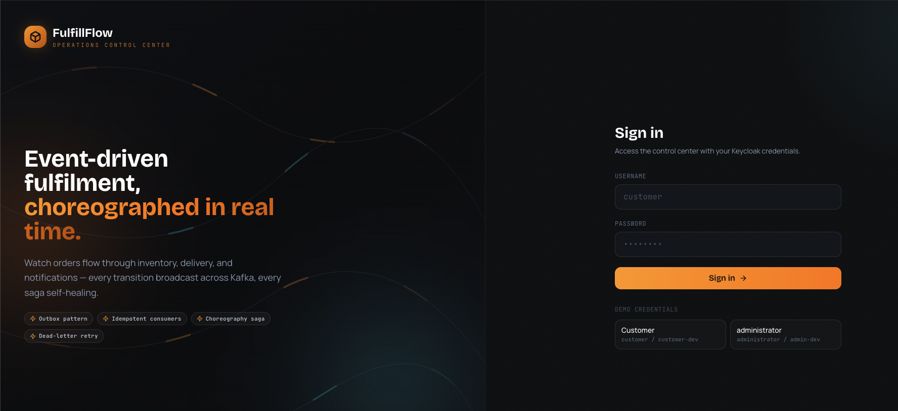
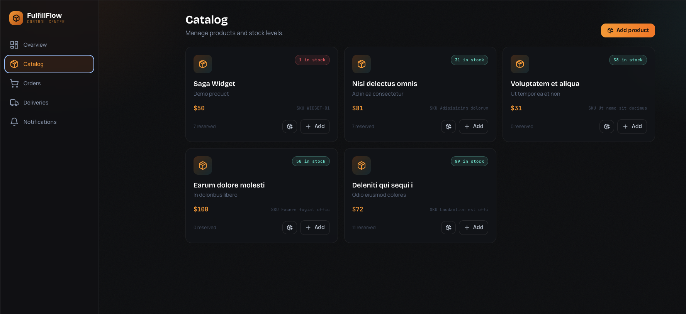
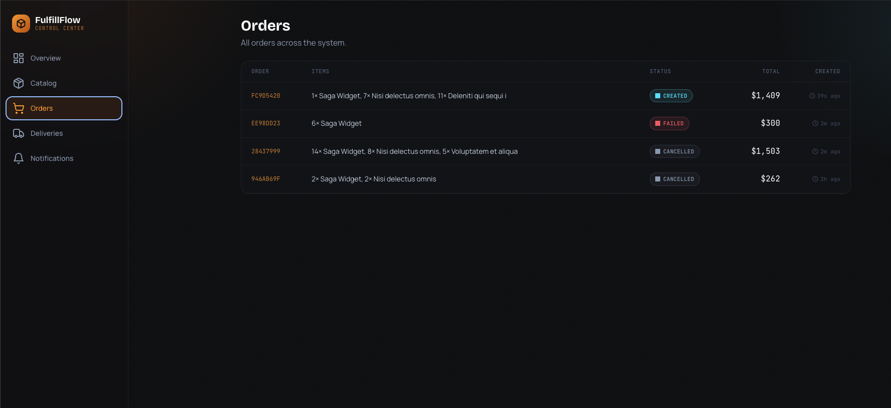
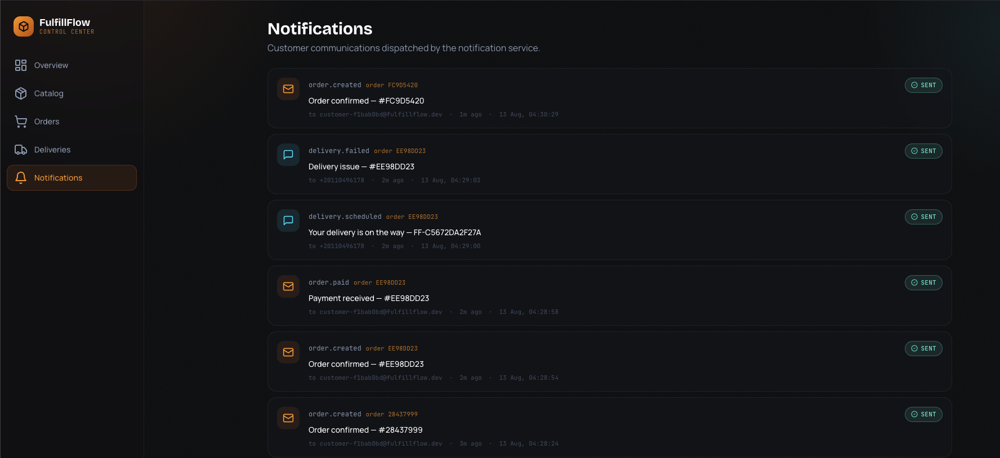
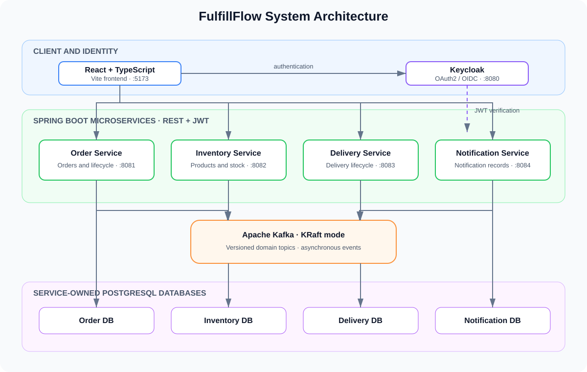
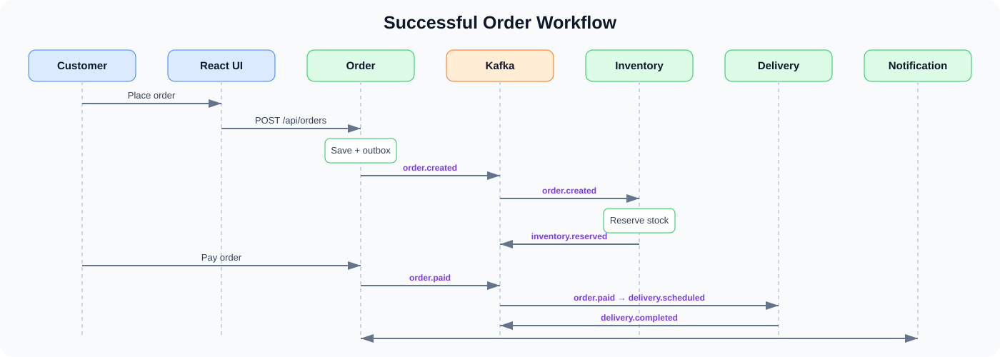
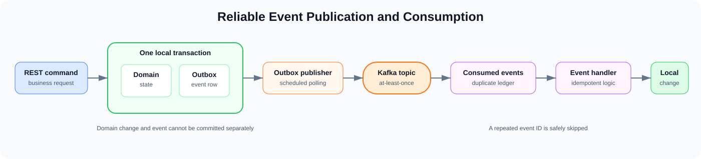

# FulfillFlow — Event-Driven Order Fulfilment Platform

<p align="center">
  A full-stack order fulfilment and delivery-management platform built to
  demonstrate reliable event-driven microservices with Java, Spring Boot,
  Apache Kafka, PostgreSQL, Keycloak, React, and TypeScript.
</p>

<p align="center">
  
  
  
  
  
  
  
</p>

> **Project status:** Portfolio project under active development. The four core
> services, Kafka event flow, transactional outbox, consumed-event ledger,
> Keycloak security, PostgreSQL migrations, and React interface are present.
> Production monitoring, comprehensive automated tests, and hardened deployment
> manifests remain roadmap work.

All users, products, orders, credentials, and business rules in this repository
are synthetic and intended for local demonstration only.

## Overview

FulfillFlow models the journey of an order across independently owned business
capabilities. A customer browses the catalogue, places and pays for an order,
inventory reserves stock, delivery schedules and completes the shipment, and
the notification service records the resulting messages.

Instead of sharing one database or coordinating every step through synchronous
HTTP calls, the services publish and consume domain events through Kafka. This
makes the project a practical demonstration of eventual consistency, local
transactions, asynchronous workflows, duplicate-message handling, and failure
compensation.

## Product Preview

<p align="center">
  
  
</p>

<p align="center">
  
  
</p>

<p align="center">
  
</p>

## Key Features

| Area | Capabilities |
| --- | --- |
| Customer experience | Secure login, product catalogue, order creation, order history, detailed order view, status timeline, and cancellation |
| Order management | Validated state transitions, line items, shipping addresses, ownership checks, and lifecycle events |
| Inventory | Product management, restocking, stock reservations, confirmation, release, and insufficient-stock handling |
| Delivery | Automatic scheduling after payment, pickup, completion, and failure workflows |
| Notifications | Event-driven, inspectable notification records using simulated channels—no real email or SMS is sent |
| Reliable messaging | Domain-based Kafka topics, transactional outbox, at-least-once delivery, and consumed-event deduplication |
| Security | Keycloak realm, OAuth2/OIDC resource servers, JWT validation, roles, and resource ownership checks |
| API experience | REST endpoints, request validation, consistent errors, health endpoints, and Swagger/OpenAPI UI |

## Architecture

FulfillFlow is a monorepo containing four independently runnable Spring Boot
services and one React application. Every service owns its data and communicates
with other domains through versioned Kafka topics.

<p align="center">
  
</p>

### Successful order workflow

<p align="center">
  
</p>

### Reliability model

<p align="center">
  
</p>

## Microservices

| Service | Port | Owns | Representative events |
| --- | ---: | --- | --- |
| Order Service | 8081 | Orders, lines, shipping addresses, state history | `order.created`, `order.paid`, `order.cancelled`, `order.fulfilled` |
| Inventory Service | 8082 | Products, stock levels, reservations | `inventory.reserved`, `inventory.reservation.failed`, `inventory.released` |
| Delivery Service | 8083 | Deliveries and delivery state | `delivery.scheduled`, `delivery.completed`, `delivery.failed` |
| Notification Service | 8084 | Simulated notification records | `notification.requested`, `notification.sent` |

Kafka uses versioned, domain-oriented topics:

```text
orders.events.v1
inventory.events.v1
deliveries.events.v1
notifications.events.v1
```

The aggregate identifier is used as the Kafka message key so events for the
same aggregate are routed to the same partition and retain per-aggregate order.

## Technology Stack

| Layer | Technologies |
| --- | --- |
| Frontend | React 18, TypeScript, Vite, React Router, TanStack Query, React Hook Form, Zod, Tailwind CSS, Framer Motion, Recharts, Lucide React |
| Backend | Java 21, Spring Boot 3.3, Spring Web, Spring Validation, Spring Data JPA, Spring Security, Spring for Apache Kafka |
| Data | PostgreSQL 16, Hibernate/JPA, Flyway migrations, database-per-service ownership |
| Messaging | Apache Kafka in KRaft mode, JSON event envelopes, domain topics, consumer groups, transactional outbox |
| Identity | Keycloak 25, OAuth2/OpenID Connect, JWT bearer tokens, role-based authorization |
| API and operations | Spring Boot Actuator, springdoc OpenAPI/Swagger UI, structured service logs |
| Local infrastructure | Docker, Docker Compose, Maven multi-module build, npm |
| Test dependencies | JUnit 5, Spring Boot Test, Spring Security Test, Spring Kafka Test, Testcontainers |

See [`docs/architecture/versions.md`](./docs/architecture/versions.md) for the
version-selection rationale.

## Engineering Concepts Demonstrated

- **Service-owned data:** no service reads or writes another service's tables.
- **Transactional outbox:** domain state and its event record are committed in
  one local transaction before asynchronous Kafka publication.
- **Idempotent consumption:** consumed event IDs are recorded so redelivery does
  not repeat a business operation.
- **Choreography-based saga:** services react to events without a central
  workflow orchestrator.
- **Compensation:** failed inventory or delivery steps trigger business actions
  that move the workflow into a safe state.
- **Eventual consistency:** service views converge through events rather than a
  cross-service database transaction.
- **State machines:** order, reservation, and delivery transitions enforce valid
  lifecycle changes.
- **Role and ownership authorization:** backend rules protect both role-specific
  operations and customer-owned resources.

The architectural decisions and their trade-offs are documented in
[`docs/adr`](./docs/adr).

## Repository Structure

```text
.
├── common/                         # Shared events, errors, security, and outbox code
├── services/
│   ├── order-service/              # Order API and order-side saga reactions
│   ├── inventory-service/          # Catalogue, stock, and reservations
│   ├── delivery-service/           # Delivery scheduling and lifecycle
│   └── notification-service/       # Simulated notification records
├── frontend/                       # React + TypeScript web application
├── infrastructure/
│   ├── docker/kafka/               # Kafka topic provisioning
│   ├── docker/postgres/            # Per-service database initialization
│   ├── keycloak/realm/             # Development realm, roles, and demo users
│   ├── kubernetes/                 # Reserved for deployment manifests
│   └── monitoring/                 # Reserved for observability configuration
├── contracts/
│   ├── asyncapi/                   # Reserved for AsyncAPI contracts
│   └── event-schemas/              # Reserved for versioned event schemas
├── docs/
│   ├── adr/                        # Architecture Decision Records
│   ├── api/                        # Reserved for API documentation
│   ├── architecture/               # Architecture diagrams and version notes
│   ├── demonstrations/             # Reserved for demonstration guides
│   └── testing/                    # Reserved for testing documentation
├── screenshots/                    # Product interface screenshots
├── scripts/                        # Local setup utilities
├── compose.yaml                    # PostgreSQL, Kafka, and Keycloak
├── Makefile                        # Local development shortcuts
└── pom.xml                         # Maven parent and module definitions
```

## Getting Started

The recommended development setup runs PostgreSQL, Kafka, and Keycloak in
Docker while the four Spring Boot services and Vite frontend run on the host.
This gives the application fast reload and keeps the infrastructure repeatable.

### Prerequisites

| Tool | Recommended version |
| --- | --- |
| Docker Engine + Docker Compose | Docker 24+ / Compose v2 |
| Java JDK | 21 |
| Maven | 3.9+ |
| Node.js | 20 LTS+ |
| npm | 10+ |
| Make | Optional |

### 1. Clone and configure

```bash
git clone https://github.com/omar-sanad/FulfillFlow.git
cd FulfillFlow
make setup
```

Without Make:

```bash
cp .env.example .env
```

The supplied values are local, synthetic development credentials. Never place
production credentials in `.env` or commit that file.

### 2. Start the infrastructure

```bash
make start-infra
```

Equivalent Docker Compose command:

```bash
docker compose --env-file .env -f compose.yaml up -d
```

Check readiness:

```bash
docker compose --env-file .env -f compose.yaml ps
```

Wait until PostgreSQL, Kafka, and Keycloak report `healthy`. The one-shot
`kafka-init` container should exit successfully after creating the topics.

### 3. Build the backend

From the repository root:

```bash
mvn clean install -DskipTests
```

This builds the Maven modules and installs the shared `common` module in your
local Maven repository.

### 4. Run the four backend services

Open four terminals at the repository root. `KAFKA_BOOTSTRAP` points host-run
applications to Kafka's exposed port.

```bash
# Terminal 1 — Order Service
KAFKA_BOOTSTRAP=localhost:29092 mvn spring-boot:run -pl services/order-service
```

```bash
# Terminal 2 — Inventory Service
KAFKA_BOOTSTRAP=localhost:29092 mvn spring-boot:run -pl services/inventory-service
```

```bash
# Terminal 3 — Delivery Service
KAFKA_BOOTSTRAP=localhost:29092 mvn spring-boot:run -pl services/delivery-service
```

```bash
# Terminal 4 — Notification Service
KAFKA_BOOTSTRAP=localhost:29092 mvn spring-boot:run -pl services/notification-service
```

Flyway applies each service's database migrations during startup.

### 5. Run the frontend

In a fifth terminal:

```bash
cd frontend
npm install
npm run dev
```

Open [http://localhost:5173](http://localhost:5173). Vite proxies each frontend
API namespace to its corresponding backend service.

### 6. Verify the services

| Component | URL |
| --- | --- |
| Frontend | [http://localhost:5173](http://localhost:5173) |
| Keycloak | [http://localhost:8080](http://localhost:8080) |
| Order health | [http://localhost:8081/actuator/health](http://localhost:8081/actuator/health) |
| Inventory health | [http://localhost:8082/actuator/health](http://localhost:8082/actuator/health) |
| Delivery health | [http://localhost:8083/actuator/health](http://localhost:8083/actuator/health) |
| Notification health | [http://localhost:8084/actuator/health](http://localhost:8084/actuator/health) |
| Order Swagger UI | [http://localhost:8081/swagger-ui.html](http://localhost:8081/swagger-ui.html) |
| Inventory Swagger UI | [http://localhost:8082/swagger-ui.html](http://localhost:8082/swagger-ui.html) |
| Delivery Swagger UI | [http://localhost:8083/swagger-ui.html](http://localhost:8083/swagger-ui.html) |
| Notification Swagger UI | [http://localhost:8084/swagger-ui.html](http://localhost:8084/swagger-ui.html) |

### 7. Stop the project

Stop each locally running Spring Boot or Vite process with `Ctrl+C`, then stop
the infrastructure while preserving its volumes:

```bash
make stop
```

To remove all local FulfillFlow database, Kafka, and Keycloak volume data:

```bash
docker compose --env-file .env -f compose.yaml down -v
```

## Demo Accounts

The imported Keycloak realm contains these synthetic users:

| Role | Username | Password |
| --- | --- | --- |
| Customer | `customer` | `customer-dev` |
| Administrator | `administrator` | `admin-dev` |
| Warehouse | `warehouse` | `warehouse-dev` |
| Courier | `courier` | `courier-dev` |

These credentials are strictly for local development.

## API Overview

| Domain | Representative endpoints |
| --- | --- |
| Orders | `GET/POST /api/orders`, `GET /api/orders/{id}`, `GET /api/orders/{id}/timeline`, `POST /api/orders/{id}/transitions` |
| Products | `GET/POST /api/products`, `GET /api/products/{id}`, `POST /api/products/{id}/restock`, `DELETE /api/products/{id}` |
| Deliveries | `GET /api/deliveries`, `GET /api/deliveries/by-order/{orderId}`, `POST /api/deliveries/{id}/pickup`, `/complete`, `/fail` |
| Notifications | `GET /api/notifications`, `GET /api/notifications/{id}`, `GET /api/notifications/by-order/{orderId}` |

The backend services expose their complete OpenAPI definitions and interactive
Swagger interfaces at the URLs listed above.

## Useful Commands

```bash
# Compile and package all backend modules
mvn clean verify

# Build and type-check the frontend
cd frontend && npm run build

# Show infrastructure status
make status

# Follow infrastructure logs
make logs

# Stop infrastructure without deleting data
make stop
```

## Architecture Decisions

The project records major decisions as ADRs so the context and trade-offs remain
visible:

1. [Microservice boundaries](./docs/adr/001-microservices.md)
2. [Kafka topics and partitioning](./docs/adr/002-kafka-topic-and-partitioning.md)
3. [Transactional outbox](./docs/adr/003-transactional-outbox.md)
4. [Idempotent consumers](./docs/adr/004-idempotent-consumers.md)
5. [Choreography-based saga](./docs/adr/005-choreography-based-saga.md)
6. [Database ownership](./docs/adr/006-database-ownership.md)
7. [Keycloak authentication](./docs/adr/007-keycloak-authentication.md)
8. [Inventory concurrency control](./docs/adr/008-inventory-concurrency-control.md)
9. [Retry and dead-letter strategy](./docs/adr/009-retry-and-dead-letter.md)
10. [Observability strategy](./docs/adr/010-observability.md)


## Engineering Highlights

This repository demonstrates:

- decomposition of an order workflow into independently owned domain services
- asynchronous, event-driven communication with Kafka
- reliable event publication without a database/Kafka dual write
- duplicate-safe handling under at-least-once message delivery
- saga collaboration and compensating actions across service boundaries
- relational domain modelling and versioned migrations per service
- JWT-based authentication plus role and ownership authorization
- a typed, role-aware React interface over multiple backend APIs
- documented architectural reasoning through Architecture Decision Records


## Author

**Omar Sanad**<br>
[GitHub](https://github.com/omar-sanad)
